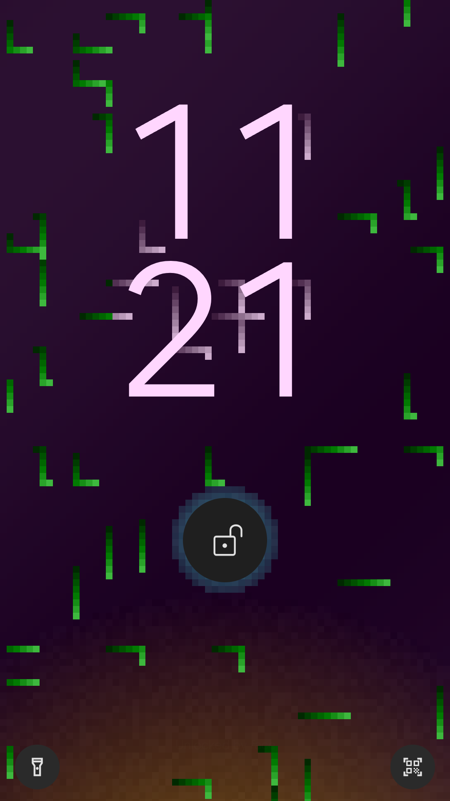

# Dora's wallpaper

**The GLSL shader code for my personal Android wallpaper!**

## Usage

1. Install the Shader Editor app from the [Play Store](https://play.google.com/store/apps/details?id=de.markusfisch.android.shadereditor) or [Github](https://github.com/markusfisch/ShaderEditor).
2. Copy wallpaper.frag into a new shader file.
3. Set the size to "1/16" at the top.
4. Set the shader as your lock screen wallpaper!

## Credits

This project would not be even close to possible without the Shader Editor app by [Markus Fisch](https://markusfisch.de/index.html), so thank you very much!!
I found the app through a [YouTube video](https://www.youtube.com/watch?v=WKB2kq3qnrQ) by Joon, so thank you for inspiring me in the first place!

  

